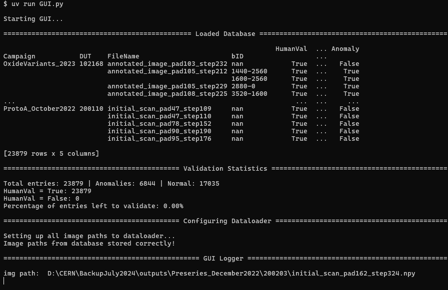
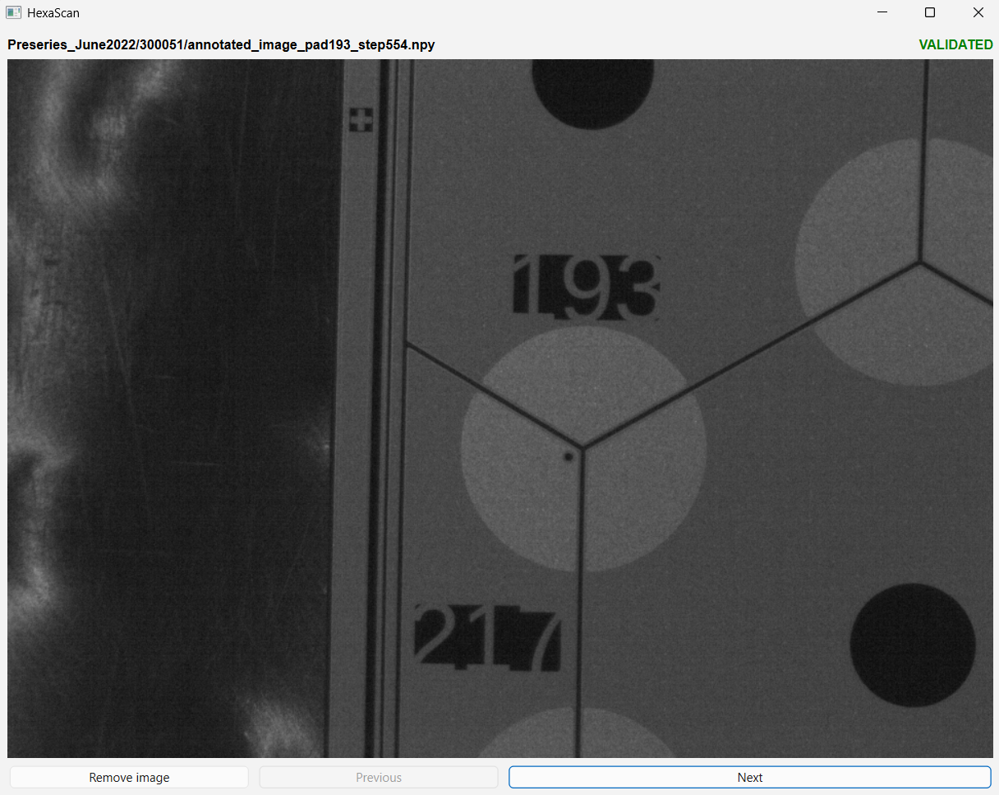

# Data Validation GUI Tool for CMS HGCAL Silicon Sensor

*AI models are only as good as the data they are trained on...*

This software is made for manual validation of anomalies (dust, scratches, crystalization, etc.) located on CMS HGCAL silicon sensors taken with an microscope. The anomalies were initially predicted using an anomaly detection AI model, consisting of autoencoders and classification models [LINK coming up], and inspected by lab users during real time of Silicon Quality Control (SQC). 

The previous classification model were prediction a lot of false negative cases, and missed some true positive cases. During my summer internship at CERN 2024, I increased the performance of the classification model from

    Recall:     68.8% --> 76.8%
    Precision:  80.7% --> 92.2%
    F1-score:   74.3% --> 83.8%

One important solution of this increase in performance was to retrain the model with more data (obtained from 2 years of SQC) and with correctly classified data. There were no previous software to validate the data and therefore this solution was created to manually inspect the predicted anomalies. 

One can

    1. Delete an image, if the image looks weird and only provides noise for the model.
    2. Remove/add anomaly boxes.

<p align="center">
  <video src="Documentation/Images/GUI_showcase.mp4" width="80%" height="auto" autoplay loop muted>
  </video>
</p>

The updated database could thereafter be used for the training of the new AI model and as a result, improved its performance compare to the previous model. 

## Installation

### Prerequisites 

Install `uv`:

**Windows:**
```powershell
powershell -c "irm https://astral.sh/uv/install.ps1 | iex"
```

**macOS/Linux/Git Bash:**
```bash
curl -LsSf https://astral.sh/uv/install.sh | sh
```

### Running the GUI
```bash
git clone https://<username>@github.com/aimaax/guihexascan
cd guihexascan
uv run GUI.py
```

`uv` will automatically set up the correct Python version and install all dependencies on first run. No manual virtual environment or `pip install` needed.

Once running, the loaded database will be printed out in the terminal with the statistics of the process of validated images and anomalies. The dataloader will load the images in batches to not overload the memory and the GUI logger will print the current image path that is displayed in the GUI. 

<p align="center">
  
  
</p>